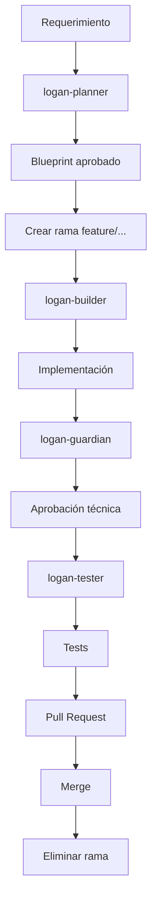
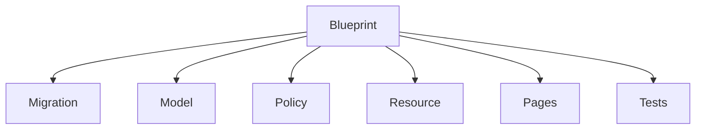
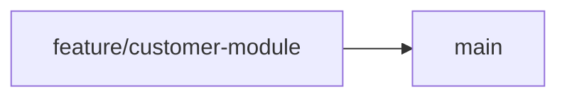
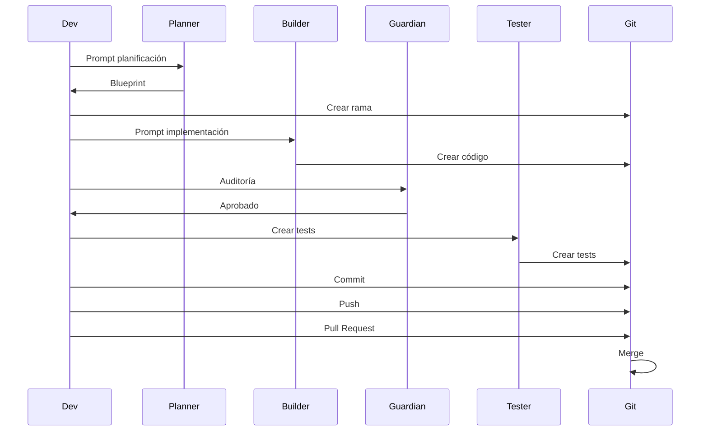

# Arquitectura de Desarrollo Guiado por Planificación (Planner → Builder → Tester)

Este proyecto utiliza una arquitectura basada en planificación obligatoria antes de la implementación, con validaciones automáticas en entorno local y remoto para garantizar consistencia, mantenibilidad y calidad del código.

Este flujo es independiente de la tecnología utilizada y puede aplicarse a cualquier tipo de proyecto.

---

# Objetivo

Garantizar que todo cambio estructural:

* Sea planificado antes de implementarse
* Siga una arquitectura consistente
* Sea validado automáticamente
* Sea testeado antes de integrarse
* Sea trazable desde su origen hasta su implementación

---

# Flujo obligatorio de desarrollo

El flujo consta de 5 fases obligatorias:

```
PLAN → BRANCH → BUILD → TEST → PULL REQUEST → MERGE → CLEANUP
```

---

# Fase 1: Planificación (Planner)

Antes de escribir cualquier código estructural, se debe crear un archivo de planificación.

Ruta:

```
.ai/plans/
```

Formato:

```
.ai/plans/NombreEntidad.md
```

Ejemplo:

```
.ai/plans/Customer.md
```

El planner define:

* Modelos
* Migraciones
* Relaciones
* Recursos
* Formularios
* Tablas
* Permisos
* Tests

Propósito:

Evitar implementación sin diseño previo.

---

# Fase 2: Creación de rama

Formato obligatorio:

```
{tipo}/{descripcion-kebab-case}
```

Tipos permitidos:

```
feature/
fix/
refactor/
config/
test/
hotfix/
```

Ejemplos válidos:

```
feature/customer-module
fix/order-total
refactor/user-resource
config/cache-settings
test/customer-resource
```

Ejemplos inválidos:

```
customer
new-feature
test123
```

Crear rama:

```
git checkout -b feature/customer-module
```

---

# Fase 3: Implementación (Builder)

El builder implementa el código basado exclusivamente en el planner.

Reglas:

* No implementar código sin planner
* No desviarse del planner sin actualizar el planner
* Mantener consistencia arquitectónica

Archivos típicos:

```
app/
database/
config/
resources/
```

---

# Fase 4: Commits

Formato obligatorio:

```
{tipo}: {descripcion}
```

Límite:

```
Máximo 300 caracteres
```

Tipos permitidos:

```
feat
fix
refactor
config
test
docs
style
chore
perf
build
ci
revert
```

Ejemplos válidos:

```
feat: create customer module
fix: correct tax calculation
refactor: simplify validation logic
config: update cache configuration
test: add customer module tests
```

Ejemplos inválidos:

```
add customer
fix bug
update
```

---

# Fase 5: Testing (Tester)

Todo cambio estructural debe ser probado.

Ejecutar:

```
php artisan test
```

o equivalente según el proyecto.

Objetivos:

* Validar funcionalidad
* Detectar regresiones
* Garantizar estabilidad

---

# Fase 6: Push

Enviar rama:

```
git push origin feature/customer-module
```

Validaciones automáticas locales verificarán:

* Formato de rama
* Formato de commit
* Tests
* Calidad del código

---

# Fase 7: Pull Request (PR)

El Pull Request debe:

* Tener planner asociado
* Tener commits válidos
* Pasar validaciones automáticas
* Pasar tests

El PR representa la unidad de integración.

---

# Fase 8: Merge

Solo se permite merge si:

* Todas las validaciones pasan
* Tests pasan
* Planner existe
* Arquitectura es consistente

Destino típico:

```
main
```

---

# Fase 9: Eliminación automática de ramas

Después del merge, las ramas son eliminadas automáticamente.

Esto evita acumulación de ramas obsoletas.

---

# Validaciones automáticas

El sistema valida automáticamente:

Localmente:

* Formato de ramas
* Formato de commits
* Calidad del código
* Tests

Remotamente:

* Existencia de planner
* Integridad arquitectónica
* Validación de Pull Request
* Tests
* Integración continua

---

# Estructura recomendada del proyecto

```
.ai/
 ├── plans/
 └── skills/

.github/
 └── workflows/

app/
config/
database/
resources/
tests/
```

---

# Reglas fundamentales

Nunca:

* Escribir código estructural sin planner
* Hacer commit sin formato válido
* Hacer push con errores
* Hacer merge sin validaciones

Siempre:

* Planificar primero
* Usar ramas correctamente
* Usar commits estructurados
* Escribir código consistente
* Validar antes de integrar

---

# Beneficios

Esta arquitectura garantiza:

* Escalabilidad
* Consistencia
* Seguridad
* Trazabilidad
* Mantenibilidad
* Facilidad de colaboración
* Reducción de errores

---

# Filosofía

Planificar primero.
Implementar segundo.
Validar siempre.

---

# Flujo resumido

```
crear planner
crear rama
implementar
commit
push
crear pull request
merge
eliminar rama
```

---

# Cumplimiento obligatorio

Este flujo es obligatorio para todos los desarrolladores y todos los cambios estructurales del proyecto.

# Flujo completo basado en Blueprint — Uso de Planner, Builder, Guardian, Tester y Refactor

Este sistema implementa una arquitectura determinista basada en Blueprint.

El Blueprint define completamente el módulo antes de su implementación.

Todos los demás roles ejecutan responsabilidades estrictas basadas en el Blueprint.

---

# Diagrama general del sistema



---

# El Blueprint es el núcleo del sistema

Archivo:

```text
.ai/plans/Customer.md
```

Este archivo define:

* Modelo
* Migración
* Resource
* Formularios
* Tabla
* Policies
* Tests

Nada puede existir fuera del Blueprint.

---

# Fase 1 — Planner

Responsable: logan-planner

Objetivo: Crear Blueprint.

Nunca escribe código.

---

## Prompt correcto

Ejemplo real:

```text
Planifica un módulo Customer con los siguientes campos:

- name (string, requerido)
- email (string, requerido, único)
- phone (string, opcional)
- is_active (boolean, default true)

Debe incluir:

- modelo
- migración
- filament resource
- formulario
- tabla
- policies
- testing

Usa formato Blueprint.
```

---

## Resultado

Archivo generado:

```text
.ai/plans/Customer.md
```

Ejemplo conceptual:

```text
# Blueprint: Customer

Modelo:
app/Models/Customer.php

Migración:
database/migrations/create_customers_table.php

Resource:
app/Filament/Resources/CustomerResource.php
```

---

# Fase 2 — Crear rama

Formato obligatorio:

```bash
feature/customer-module
```

Crear rama:

```bash
git checkout -b feature/customer-module
```

---

# Fase 3 — Builder

Responsable: logan-builder

Objetivo: Construir EXACTAMENTE el Blueprint.

Nunca diseña.

Nunca improvisa.

---

## Prompt correcto

```text
Implementa el Blueprint definido en:

.ai/plans/Customer.md
```

---

## Resultado esperado

Archivos creados:

```text
app/Models/Customer.php
database/migrations/create_customers_table.php
app/Filament/Resources/CustomerResource.php
app/Policies/CustomerPolicy.php
```

---

# Diagrama Builder



---

# Fase 4 — Guardian

Responsable: logan-guardian

Objetivo: Auditar implementación.

Detecta:

* violaciones
* errores
* inconsistencias

Nunca modifica código.

---

## Prompt correcto

```text
Audita el siguiente código contra el Blueprint:

.ai/plans/Customer.md

Archivos:

app/Models/Customer.php
app/Filament/Resources/CustomerResource.php
database/migrations/create_customers_table.php
```

---

## Resultado esperado

```text
Estado general: Correcto

Violaciones CRITICAL: Ninguna

Recomendación final: APROBADO
```

---

# Fase 5 — Tester

Responsable: logan-tester

Objetivo: Crear tests basados en Blueprint.

---

## Prompt correcto

```text
Genera tests para el Blueprint:

.ai/plans/Customer.md
```

---

## Resultado esperado

Archivo:

```text
tests/Feature/Filament/CustomerResourceTest.php
```

---

# Fase 6 — Commit

Formato obligatorio:

```bash
feat: implement customer module
```

Ejemplo:

```bash
git commit -m "feat: implement customer module"
```

---

# Fase 7 — Push

```bash
git push origin feature/customer-module
```

---

# Fase 8 — Pull Request

```text
feature/customer-module → main
```

Validaciones ejecutadas:

* planner existe
* builder consistente
* guardian aprobado
* tests válidos

---

# Fase 9 — Merge

Después del merge:



Rama eliminada automáticamente.

---

# Fase 10 — Refactor (Opcional)

Responsable: logan-refactor

Objetivo:

Mejorar código SIN alterar Blueprint.

---

## Prompt correcto

```text
Refactoriza el siguiente archivo sin alterar el Blueprint:

app/Models/Customer.php

Blueprint:

.ai/plans/Customer.md
```

---

# Diagrama completo del ciclo de vida



---

# Resumen de responsabilidades

| Skill          | Responsabilidad                            |
| -------------- | ------------------------------------------ |
| logan-planner  | Diseñar Blueprint                          |
| logan-builder  | Implementar Blueprint                      |
| logan-guardian | Auditar implementación                     |
| logan-tester   | Crear tests                                |
| logan-refactor | Mejorar calidad sin cambiar comportamiento |

---

# Regla fundamental absoluta

Blueprint es la única fuente de verdad.

Si algo no está en el Blueprint:

No existe.

No puede implementarse.

---

# Ejemplo completo real

Planner prompt:

```text
Planifica módulo Product con:

- name
- price
- is_active
```

Builder prompt:

```text
Implementa Blueprint:

.ai/plans/Product.md
```

Guardian prompt:

```text
Audita implementación contra Blueprint Product
```

Tester prompt:

```text
Genera tests para Blueprint Product
```

Refactor prompt:

```text
Refactoriza Product sin alterar Blueprint
```

---

# Resultado final

Sistema determinista.

Predecible.

Auditable.

Seguro.

Escalable.
