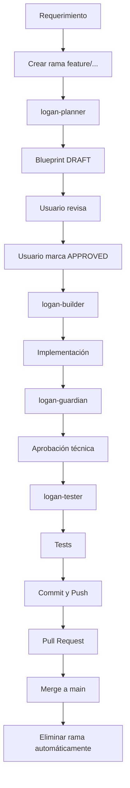

# Blueprint-Driven Development System

Laravel 12 + Filament v5

---

# Propósito

Este sistema implementa un flujo de desarrollo determinista basado en Blueprints.

El objetivo es eliminar:

* improvisación
* ambigüedad
* desviaciones arquitectónicas
* malas prácticas
* modificaciones no auditadas

Todo el código debe originarse desde un Blueprint aprobado.

---

# Principio fundamental

No se escribe código primero.

Primero se diseña el Blueprint.
Luego se implementa.
Luego se audita.
Luego se prueba.

Nunca al revés.

---

# Arquitectura del sistema

```
.ai/
│
├── blueprints/
│   ├── _template.md
│   ├── Product.md
│   ├── Order.md
│   └── Customer.md
│
├── skills/
│   ├── logan-planner/
│   ├── logan-builder/
│   ├── logan-guardian/
│   ├── logan-refactor/
│   └── logan-tester/
```

---

# Componentes del sistema

## 1. logan-planner

Responsabilidad: Diseñar el Blueprint.

Nunca escribe código.

Produce:

```
.ai/blueprints/{Module}.md
```

Define:

* modelo
* migración
* resource
* forms
* table
* policy
* tests
* relaciones
* enums

Estado inicial:

```
DRAFT
```

---

## 2. logan-builder

Responsabilidad: Implementar código.

Fuente única de verdad:

```
Blueprint APPROVED
```

Nunca:

* diseña
* mejora
* optimiza
* agrega campos

Solo implementa exactamente lo definido.

Orden obligatorio:

1. Migración
2. Modelo
3. Enum
4. Policy
5. Resource
6. Pages
7. RelationManagers
8. Tests

---

## 3. logan-guardian

Responsabilidad: Auditar implementación.

Detecta:

* desviaciones del Blueprint
* malas prácticas
* violaciones arquitectónicas

Nunca modifica código.

Resultado posible:

```
APROBADO
APROBADO CON ADVERTENCIAS
RECHAZADO
```

---

## 4. logan-tester

Responsabilidad: Generar tests.

Valida:

* creación
* edición
* eliminación
* listado
* validaciones definidas

Nunca inventa lógica.

---

## 5. logan-refactor

Responsabilidad: mejorar calidad interna.

Nunca cambia comportamiento.

Permitido:

* mejorar legibilidad
* mejorar tipado
* mejorar orden

Prohibido:

* cambiar arquitectura
* agregar campos
* eliminar campos

---

# Blueprint

El Blueprint es la especificación técnica completa del módulo.

Ubicación:

```
.ai/blueprints/
```

Debe usar la plantilla oficial:

```
.ai/blueprints/_template.md
```

---

# Estados del Blueprint

## DRAFT

Diseño incompleto o no aprobado.

No se puede implementar.

---

## APPROVED

Diseño aprobado.

Puede implementarse.

---

## IMPLEMENTED

Código implementado y auditado.

---

## DEPRECATED

Ya no debe usarse.

---

# Regla crítica

logan-builder solo puede implementar Blueprints en estado:

```
APPROVED
```

---

# Flujo completo

```
Usuario solicita módulo
        │
        ▼
logan-planner
        │
        ▼
Blueprint (DRAFT)
        │
        ▼
Usuario revisa y aprueba
        │
        ▼
Blueprint (APPROVED)
        │
        ▼
logan-builder
        │
        ▼
Código generado
        │
        ▼
logan-guardian
        │
        ▼
Auditoría
        │
        ▼
logan-tester
        │
        ▼
Tests generados
        │
        ▼
Blueprint (IMPLEMENTED)
```

---

# Fuente única de verdad

El Blueprint es la única fuente válida de arquitectura.

El código debe coincidir exactamente.

Nunca al revés.

---

# Regla de integridad

Si el Blueprint no define algo:

No existe.

No puede implementarse.

---

# Beneficios

Consistencia total
Arquitectura controlada
Auditoría completa
Escalabilidad segura
Sin improvisación
Compatible con IA determinista

---

# Cómo crear un nuevo módulo

Paso 1

Solicitar Blueprint:

```
Usar logan-planner para crear módulo Product
Campos:
- name
- price
```

Paso 2

Revisar Blueprint generado.

Paso 3

Cambiar estado a:

```
APPROVED
```

Paso 4

Solicitar implementación:

```
Usar logan-builder para implementar Product
```

Paso 5

Auditar:

```
Usar logan-guardian para auditar Product
```

Paso 6

Generar tests:

```
Usar logan-tester para Product
```

---

# Reglas absolutas

Nunca escribir código sin Blueprint.

Nunca modificar arquitectura sin actualizar Blueprint.

Nunca implementar Blueprint en estado DRAFT.

Nunca asumir campos.

Nunca improvisar.

---

# Resultado final

Sistema determinista.

Arquitectura consistente.

Código auditable.

Seguro para escalar.

Control total sobre Filament v5 y Laravel 12.

# Flujo completo basado en Blueprint — Uso de Planner, Builder, Guardian, Tester y Refactor

Este sistema implementa una arquitectura determinista basada en Blueprint.

El Blueprint define completamente el módulo antes de su implementación.

Todos los demás roles ejecutan responsabilidades estrictas basadas en el Blueprint.

**Regla crítica:**  
El Blueprint siempre se crea dentro de una rama dedicada.  
Nunca se crea directamente en `main`.

El estado `APPROVED` solo puede ser definido por el usuario.

---

# Diagrama general del sistema



---

# El Blueprint es el núcleo del sistema

Ubicación:

```
.ai/blueprints/
```

Ejemplo:

```
.ai/blueprints/Customer.md
```

Este archivo define completamente:

- Modelo
- Migración
- Filament Resource
- Formularios
- Tabla
- Policies
- Tests
- Relaciones
- Enums

Nada puede existir fuera del Blueprint.

---

# Fase 0 — Crear rama (PRIMER PASO OBLIGATORIO)

Siempre crear una rama antes de planificar.

Formato obligatorio:

```bash
feature/{nombre-modulo}
```

Ejemplo:

```bash
git checkout -b feature/customer-module
```

Esto garantiza que:

- El Blueprint no llegará accidentalmente a main
- El desarrollo queda aislado
- Todo el ciclo ocurre dentro de la rama

---

# Fase 1 — Planner (crear Blueprint)

Responsable: logan-planner

Objetivo: Crear Blueprint en estado DRAFT.

Nunca escribe código.

---

## Prompt correcto

```
Usa logan-planner para planificar el módulo Customer.

Campos:

- name (string, requerido)
- email (string, requerido, único)
- phone (string, opcional)
- is_active (boolean, default true)

Genera el Blueprint completo.
```

---

# Fase 2 — Aprobación del usuario (PASO CRÍTICO)

Solo el usuario puede aprobar el Blueprint.

La IA nunca aprueba Blueprints.

El usuario debe cambiar manualmente el Blueprint a:

```
Estado: APPROVED
```

Ejemplo:

```
# Blueprint: Customer

Estado: APPROVED
```

Sin este estado:

logan-builder no debe ejecutarse.

---

# Fase 3 — Builder (implementación)

Responsable: logan-builder

Objetivo: Implementar EXACTAMENTE el Blueprint APPROVED.

Nunca:

- diseña
- improvisa
- agrega campos

---

## Prompt correcto

```
Usa logan-builder para implementar el Blueprint:

.ai/blueprints/Customer.md
```

---

# Fase 4 — Guardian (auditoría)

Responsable: logan-guardian

Objetivo: Auditar que el código coincide exactamente con el Blueprint.

Nunca modifica código.

---

## Prompt correcto

```
Usa logan-guardian para auditar contra el Blueprint:

.ai/blueprints/Customer.md
```

---

# Fase 5 — Tester (tests)

Responsable: logan-tester

Objetivo: Generar tests basados estrictamente en Blueprint.

---

## Prompt correcto

```
Usa logan-tester para generar tests del Blueprint:

.ai/blueprints/Customer.md
```

---

# Fase 6 — Commit

Formato obligatorio:

```
{tipo}: {descripcion}
```

Tipos permitidos:

```
feat
fix
refactor
test
docs
chore
perf
build
ci
```

Ejemplo válido:

```bash
git commit -m "feat: implement customer module"
```

Reglas:

- máximo 300 caracteres
- en minúsculas
- sin punto final
- debe describir el cambio claramente

---

# Fase 7 — Push

```bash
git push origin feature/customer-module
```

---

# Fase 8 — Pull Request

```
feature/customer-module → main
```

Validaciones automáticas:

- existe Blueprint
- Blueprint está APPROVED
- implementación coincide
- tests válidos
- formato correcto

---

# Fase 9 — Merge

Después del merge la rama será eliminada automáticamente.

---

# Fase 10 — Refactor (opcional)

Responsable: logan-refactor

Objetivo: mejorar calidad interna sin alterar Blueprint.

---

## Prompt correcto

```
Usa logan-refactor para mejorar este archivo sin alterar Blueprint:

app/Models/Customer.php

Blueprint:

.ai/blueprints/Customer.md
```

---

# Resultado final

Sistema determinista  
Arquitectura protegida  
Sin improvisación  
Sin desviaciones  
Seguro para escalar  
Compatible con Laravel 12 y Filament v5
